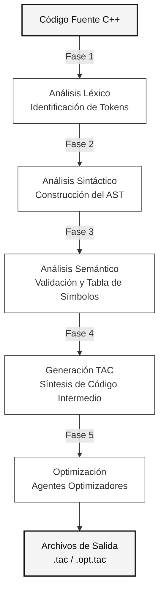

<div align="center">
  <h1>Compilador C++ (Subconjunto)</h1>
  <p><strong>Técnicas de Compilación — Universidad Blas Pascal (2026)</strong></p>
  
  [](#)
  [](#)
  [](#)
</div>

---

## Introducción

El presente documento constituye la documentación y el Informe Técnico del proyecto de compilador desarrollado. Este proyecto consiste en un traductor completo implementado en el lenguaje **Java** haciendo uso de la herramienta de reconocimiento léxico y sintáctico **ANTLR4**. El objetivo principal radica en el análisis de código fuente correspondiente a un subconjunto específico del lenguaje C++, validando su correctitud lógica y semántica, para finalmente generar un Código de Tres Direcciones (TAC) debidamente optimizado.

---

## Equipo de Desarrollo

El diseño e implementación de este compilador fue llevado a cabo de forma colaborativa por el siguiente equipo:

| Desarrolladores |
| :--- |
|  &nbsp; [**Guillermo Gabriel Gimenez**](https://github.com/gabexe) | 
|  &nbsp; [**Mateo Agustin Gomes**](https://github.com/MateoG-2004) | 
|  &nbsp; [**Donato Mauro Mattio**](https://github.com/dommattio) | 

---

## Estructura del Proyecto

El repositorio adopta una arquitectura estándar de proyectos Maven, facilitando la separación entre la lógica central del compilador y el entorno de pruebas unitarias:

```text
TC-FINAL/
├── 📄 pom.xml                    # Gestión de dependencias (ANTLR4) y ciclo de construcción
├── 📄 README.md                  # Especificaciones de la cátedra
├── 📄 CHANGELOG.md               # Registro de control de versiones
├── 📄 DOCUMENTACION.md           # Informe técnico actual
└── 📁 src/
    ├── 📁 main/java/com/compilador/  # Lógica principal del compilador
    │   ├── 📝 App.java               # Punto de entrada y orquestación
    │   ├── 📝 MiLenguaje.g4          # Gramática formal definida para ANTLR4
    │   ├── 📝 AnalizadorLexico.java  # Análisis lexicográfico (Fase 1)
    │   ├── 📝 ASTBuilder.java        # Construcción del Árbol de Sintaxis Abstracta (Fase 2)
    │   ├── 📝 AnalizadorSemantico.java # Análisis de coherencia (Fase 3)
    │   ├── 📝 TablaSimbolos.java     # Gestión de memoria y validación de ámbitos (Scope)
    │   ├── 📝 GeneradorTAC.java      # Síntesis de código intermedio (Fase 4)
    │   ├── 📝 Optimizador.java       # Módulo de mejora de rendimiento (Fase 5)
    │   └── 📝 GeneradorArchivos.java # Escritura de artefactos resultantes
    └── 📁 test/                      # Archivos fuente para validación
        ├── 📄 ejemplo_correcto.cpp   # Prueba de flujo de compilación exitoso
        └── 📄 ejemplo_con_errores.cpp# Prueba diseñada para invocar fallos semánticos
```

---

## Arquitectura y Flujo de Datos

El diseño arquitectónico del compilador se estructura sobre un pipeline secuencial de 5 fases. Este enfoque garantiza que las inconsistencias detectadas en etapas tempranas detengan la compilación, mitigando la propagación de errores hacia las etapas de síntesis y optimización.



---

## Desarrollo Cronológico por Fases

### Fase 1: Análisis Léxico *(Abril 2026)*
> [!NOTE]
> **Objetivo:** Leer el código fuente e identificar las unidades léxicas indivisibles (Tokens), tales como palabras reservadas, identificadores, literales y operadores.

- Desarrollo de las reglas gramaticales base mediante el archivo `MiLenguaje.g4`.
- Integración con **Maven** para la generación automatizada del analizador léxico (*Lexer*) a través de ANTLR4.

### Fase 2: Análisis Sintáctico *(Mayo 2026)*
> [!NOTE]
> **Objetivo:** Validar que la secuencia de *Tokens* se ajuste estrictamente a las reglas gramaticales que rigen la estructura formal del subconjunto de C++.

- Implementación del Árbol de Sintaxis Abstracta (**AST**) como representación en memoria de las estructuras gramaticales.
- Incorporación del módulo `ManejadorErrores` para la interceptación temprana de secuencias inválidas o *Tokens* espurios.

### Fase 3: Análisis Semántico *(Junio 2026)*
> [!IMPORTANT]
> **Objetivo:** Auditar la coherencia del programa, validando compatibilidad de tipos, correctitud de asignaciones y la correcta resolución de referencias a identificadores dentro de su ámbito de vida (*scope*).

- Se introdujo la estructura de datos **Tabla de Símbolos**, la cual retiene la información de los identificadores declarados y su ciclo de vida.
- Se implementó un sistema de **Diagnósticos Semánticos** para categorizar anomalías:
  - **[ERROR]:** Uso de variables no definidas o colisiones de nombres (provoca la finalización temprana del proceso).
  - **[WARNING]:** Detección de variables asignadas que nunca son referenciadas (Código Muerto). Estas anomalías permiten que la compilación continúe.

<details>
<summary>Fragmento de diagnóstico de variables subutilizadas</summary>

```cpp
int main() {
    int x = 10;
    int inutil = 100; // El análisis semántico intercepta esta línea generando un [WARNING]
    return x;
}
```
</details>

### Fase 4: Código Intermedio (TAC) *(Junio 2026)*
> [!NOTE]
> **Objetivo:** Realizar la síntesis del programa abstrayendo la arquitectura de destino mediante un Código de Tres Direcciones (TAC).

- Traducción de expresiones anidadas hacia secuencias de instrucciones unitarias (ej. `z = x + y * 2` se traduce a `t0 = y * 2`, `t1 = x + t0`, `z = t1`).
- Los saltos de control condicionales (`if`) y las estructuras de iteración (`while`, `for`) son modelados estructuralmente a través de bifurcaciones directas (`goto`) hacia etiquetas (ej. `L0`, `L1`).

### Fase 5: Optimización *(Junio 2026)*
> [!TIP]
> **Objetivo:** Analizar y depurar el TAC generado mediante heurísticas específicas para reducir el volumen de instrucciones y mejorar la eficiencia del cálculo en tiempo de ejecución.

- **Plegamiento de Constantes (*Constant Folding*):** Resolución de literales en etapa de compilación (ej. reemplazo directo de `t0 = 5 + 5` por `t0 = 10`).
- **Eliminación de Redundancias:** Purgado de instrucciones y bifurcaciones inalcanzables.
- **Salida del Compilador:** La clase `GeneradorArchivos` escribe físicamente los resultados en los artefactos correspondientes en el directorio del entorno.

---

## Manual de Ejecución

Para replicar el proceso de compilación localmente y someter programas a la cadena de análisis, deben seguirse los siguientes comandos de consola:

1. **Resolución de dependencias y empaquetado inicial:**
   ```bash
   mvn clean install
   ```
2. **Invocación del ciclo de compilación sobre un archivo de prueba:**
   ```bash
   mvn exec:java -Dexec.mainClass="com.compilador.App" -Dexec.args="src/test/ejemplo_correcto.cpp"
   ```

El *standard output* presentará un resumen detallado que abarca:
- El Parse Tree construido.
- El volcado de los contextos retenidos en la Tabla de Símbolos.
- Informes de Diagnóstico Semántico.
- El Código TAC resultante (antes y después de la fase de optimización).

---
<div align="center">
  <i>Documentación técnica – Universidad Blas Pascal, 2026</i>
</div>
